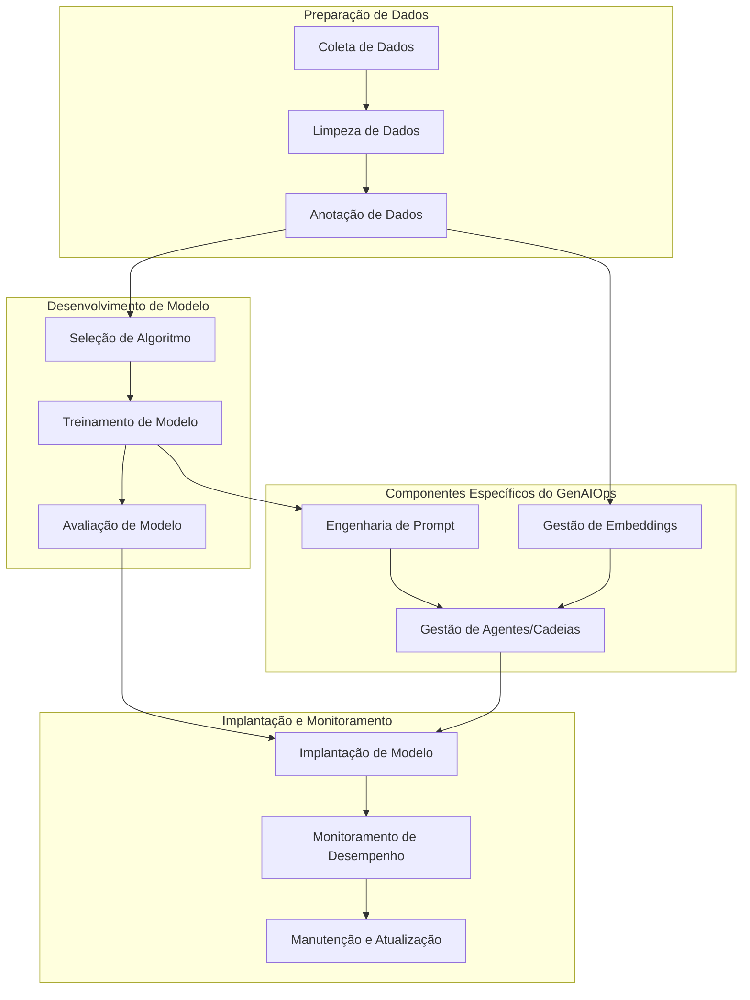

O artigo "MLOps e GenAIOps para cargas de trabalho de IA no Azure" aborda as operações de cargas de trabalho de Inteligência Artificial (IA), enfatizando a importância de metodologias como DevOps, DataOps, MLOps e GenAIOps para garantir eficiência, qualidade e confiabilidade.

**Principais pontos abordados:**

- **DataOps:** Focado no gerenciamento do ciclo de vida dos dados, simplificando processos como extração, transformação e carregamento (ETL/ELT).

- **MLOps:** Responsável por operacionalizar fluxos de trabalho de aprendizado de máquina, abrangendo desde o treinamento até o teste de modelos.

- **GenAIOps:** Um subconjunto especializado do MLOps que se concentra em soluções de IA generativa, incluindo tarefas como descoberta de modelos e refinamento de modelos pré-treinados com dados enriquecidos.

O artigo destaca que, embora essas metodologias tenham atividades operacionais que frequentemente se sobrepõem, a adoção de práticas padronizadas e o uso de ferramentas especializadas são essenciais para minimizar riscos, manter a precisão dos modelos e assegurar processos repetíveis e consistentes. Além disso, a automação e o monitoramento contínuo são enfatizados como estratégias-chave para alcançar esses objetivos.

GenAIOps (Operações de IA Generativa) é uma extensão do MLOps (Operações de Aprendizado de Máquina) que aborda os desafios específicos da operacionalização de soluções de IA generativa em ambientes corporativos. Enquanto o MLOps foca na automação e gerenciamento do ciclo de vida de modelos de aprendizado de máquina tradicionais, o GenAIOps incorpora práticas adicionais para lidar com as particularidades dos modelos de IA generativa, como modelos de linguagem de grande escala (LLMs). citeturn0search1

**Principais componentes do GenAIOps:**

1. **Engenharia de Prompt:** Desenvolvimento e refinamento de prompts eficazes para interagir com modelos generativos, garantindo respostas mais precisas e relevantes.

2. **Gestão de Embeddings:** Criação, armazenamento e versionamento de representações vetoriais densas (embeddings) que capturam características semânticas de dados, facilitando buscas por similaridade e outras operações.

3. **Gestão de Agentes/Cadeias:** Definição e gerenciamento de processos complexos que combinam múltiplos modelos fundamentais e APIs, permitindo funcionalidades avançadas e integração com sistemas externos.

**Fluxograma Integrado de MLOps e GenAIOps:**

**Descrição do Fluxograma:**

- **Preparação de Dados:** Envolve a coleta, limpeza e anotação de dados, etapas essenciais para garantir a qualidade dos dados utilizados no treinamento dos modelos.

- **Desenvolvimento de Modelo:** Inclui a seleção do algoritmo adequado, treinamento do modelo com os dados preparados e avaliação de seu desempenho.

- **Implantação e Monitoramento:** Abrange a implantação do modelo em ambiente de produção, monitoramento contínuo de seu desempenho e manutenção ou atualização conforme necessário.

- **Componentes Específicos do GenAIOps:**

  - **Engenharia de Prompt:** Após o treinamento do modelo, desenvolvem-se prompts eficazes para interagir com modelos generativos.

  - **Gestão de Embeddings:** Durante a preparação e anotação de dados, criam-se embeddings que capturam características semânticas dos dados.

  - **Gestão de Agentes/Cadeias:** Integra as etapas de engenharia de prompt e gestão de embeddings, permitindo processos complexos que combinam múltiplos modelos e APIs, culminando na implantação eficaz do modelo.

Este fluxograma integrado ilustra como as práticas tradicionais de MLOps se combinam com os componentes específicos do GenAIOps para operacionalizar soluções de IA generativa de forma eficiente e eficaz. 
